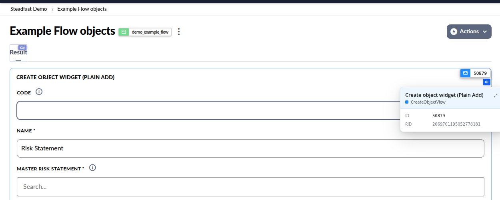
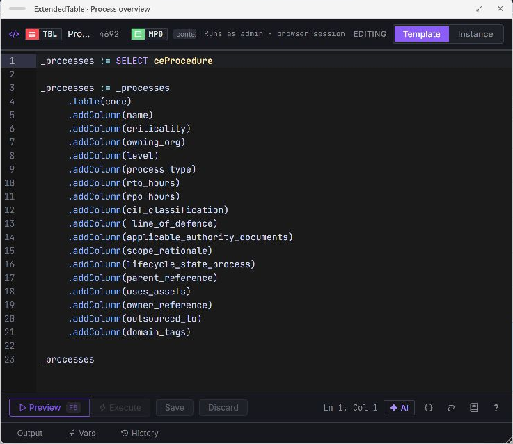
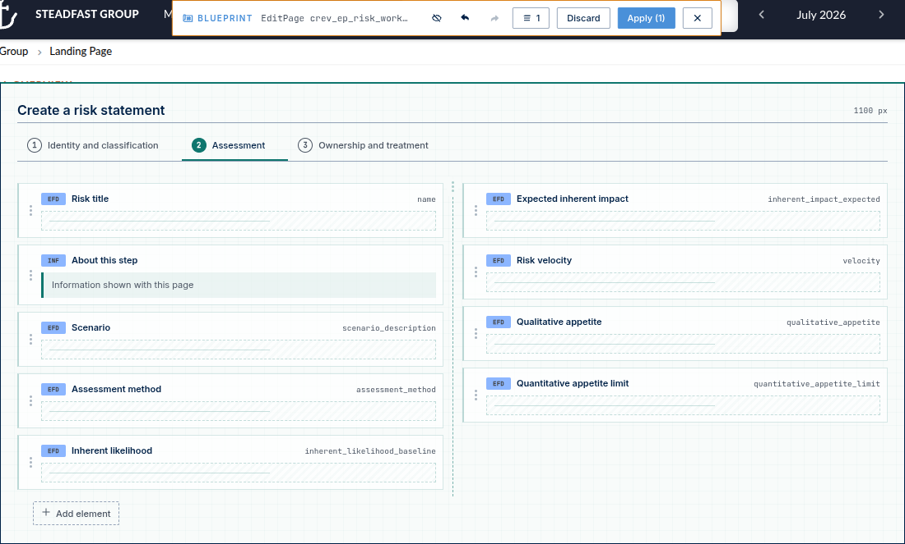
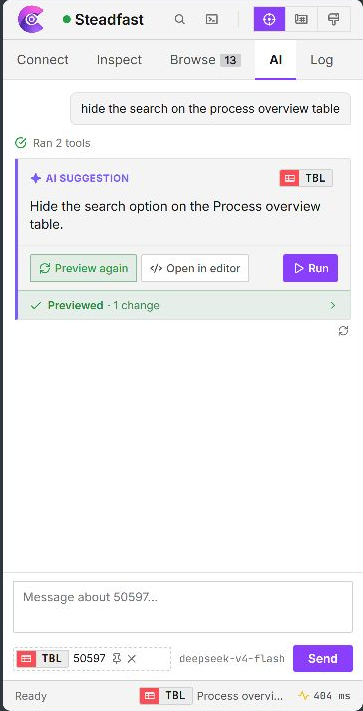

# Configuration Companion

Configuration Companion is a Chrome and Edge side-panel extension for inspecting and changing Corporater BMP without opening Configuration Studio. It labels the objects rendered on a BMP page, opens their real configuration, edits code, and stages visual layout changes.

## Install

1. Download `configuration-companion-x.y.z.zip` from [Releases](https://github.com/HeinemannT/configuration-companion/releases/latest) and unzip it into a stable folder that you will reuse for updates.
2. Open `chrome://extensions/` (Edge: `edge://extensions/`) and enable **Developer mode**.
3. Click **Load unpacked** and select the unzipped folder.
4. Pin Configuration Companion and open your BMP workspace.

Current Chromium browsers are supported (Chrome or Edge 116+).

### Update an unpacked installation

Replace the contents of that same stable folder with the new release, then click **Reload** for Configuration Companion on `chrome://extensions/` (Edge: `edge://extensions/`). Keep the folder path unchanged; loading each release from a different versioned folder creates a separate unpacked installation.

## Connect to BMP

Add the workspace URL under **Connect**, approve Chrome's site-access prompt, and choose the identity used for Configuration Studio commands:

- **Use browser login** runs commands as the user signed into the BMP page and supports SSO.
- **Use stored configuration login** obtains an independent BMP command ticket. The website stays signed in as the portal user, while configuration reads and writes run as the stored account.

Connect shows the verified **Portal** and **Commands** identities separately. Workspace search, live CVO data, downloads, page navigation, and visible portal content retain the portal identity. Configuration lookup, Extended Code, property saves, and Blueprint use the command identity. A stored command account does not broaden what portal search or live data can see.

## Inspect the objects behind the page

Turn on **Inspect** from the header or press `Ctrl+Shift+X`. Companion outlines rendered BMP objects and adds a type-coloured ID pill.

<p align="center">
  
</p>

| Gesture | Result |
|---|---|
| Click | Open the object in the side panel; copy buttons copy the primary ID (template when available) |
| Double-click | Open the quick inspector |
| Alt-click | Copy the RID |
| Shift-click | Copy the concrete instance ID |
| Ctrl-click | Copy an instance reference such as `t.some_id` |
| Right-click an element | Use it as the current context |

The object view groups what you can do:

- **Info** is the first view. It shows type, template ID, instance ID, and RID above direct and referenced code properties.
- **Flow** appears for supported flow-bearing objects and shows their action or input chain.
- **Structure** shows parents, children, linked objects, and siblings. Non-flow relationships remain in Info.
- **Template / This instance** chooses where a supported property or name change is saved. The instance remains available as an explicit target.

Use the pencil beside a supported object name to rename it. Companion asks for confirmation before saving.

## Edit Extended Code, HTML, and CVOs

The Extended Code editor opens from a code property or with `Ctrl+Shift+E`. It provides EC syntax highlighting, completion, hover documentation, linting, folding, runtime errors, and object-aware suggestions for `t.<id>` references and inferred variables.

<p align="center">
  
</p>

Use **Preview** (`Ctrl+Enter`) before **Run** (`Ctrl+Shift+Enter`). Run stays gated until the current code previews successfully. The lower panel shows structured output, tracked variables, run history, timings, and safe HTML or JSON views when the output supports them.

Text and CVO properties open in their dedicated studios:

- **Text/HTML** previews the stored HTML in an inert, sanitized frame.
- **CVO Studio** edits HTML and JavaScript side by side, supplies live CVO data, manages inputs and hosted resources, and runs the preview in a separate sandbox.

## Rebuild a page in Blueprint

Press `Ctrl+Shift+B` to place Blueprint over the live page. Choose **Template** or **This instance**, then work with the structure BMP actually renders.

<p align="center">
  
</p>

Blueprint supports:

- adding, moving, reordering, resizing, renaming, and removing supported tabs, containers, and widgets
- editing layout and visual properties without leaving the page
- following InputView to InputSet and CreateObjectView to EditPage
- creating and linking a missing InputSet or EditPage
- inspecting action menus and supported flow chains in place

Changes remain staged. The counter, undo, redo, and discard controls operate on the draft. **Apply** first shows the affected objects, then asks for confirmation before it writes to BMP.

### Edit pages

<p align="center">
  
</p>

Edit Page Blueprint follows page navigation, page breaks, columns, field order, and the configured form width. Move fields within or between columns and pages, add supported elements, and edit field properties while seeing the rendered form structure.

A CreateObjectView can select an existing EditPage or stage a new one. New EditPages inherit the object class needed to configure their fields immediately.

## Find references, code, and differences

- **Browse** searches by name, type, template ID, instance ID, or RID. Live hits are enriched with both reusable-template and concrete-instance identity when available.
- **Code Search** scans Extended Code across the workspace and opens the exact source property.
- **References** answers "Who references this?" from the current object.
- **Diff** compares RID to RID, instance to template, or two `namespace.businessId` references.

## Use the optional AI assistant

Configure a provider under **Connect → AI Assistant → Set up**. Companion supports Anthropic, OpenAI, DeepSeek, Grok, and custom compatible endpoints.

Use the assistant to:

- explain the selected object, its properties, references, and place in the page
- trace supported widget and action flows
- find workspace objects and return them as hoverable, clickable object chips
- explain, draft, or revise Extended Code using the current editor context
- create or edit BMP objects through compact Change Tickets
- work through HTML, CVO, and JSON transformation problems

The assistant inspects workspace context with read-only tools. For a requested change, it returns one compact Change Ticket and automatically **Previews** its exact Extended Code. You can inspect it, open it in the Extended Code editor, or explicitly **Run** that same previewed code; nothing is committed merely because the assistant proposed it.

<p align="center">
  
</p>

### AI benchmark

The sidebar benchmark tested **Gemini 3.1 Flash Lite** with 25 realistic configurator requests. These included finding the correct object, explaining configuration, changing properties, creating or moving page structure, generating safe HTML and Extended Code, and answering questions about risks and controls.

| Measurement | Result |
|---|---|
| Complete task | **23 of 25 (92%)** produced the correct answer or previewable change and met the task requirements |
| Code and configuration structure | **24 of 25 (96%)** passed the required automated checks |
| Target selection | **25 of 25 (100%)** chose the intended object and workflow |
| Speed and cost | **1.46 s median** in the serial latency test · approximately **$0.009 per response** |

The Extended Code editor was tested separately with **DeepSeek V4 Flash**. It received 12 editing problems that had not been used while developing its instructions, with three attempts per problem. The tasks covered persisted assignments, SELECT results followed by list operations, function results followed by method calls, JSON calculations, and preserving existing code while making focused changes.

| Measurement | Result |
|---|---|
| Correct Extended Code edit | **27 of 36 (75%)** passed the required syntax and task-specific behavior checks |
| Answer quality | **94%** were judged to provide a useful and relevant answer |

*Benchmark run: 16 August 2026.*

## Shortcuts

| Default | Action |
|---|---|
| `Ctrl+Shift+Y` | Toggle the side panel |
| `Ctrl+Shift+X` | Toggle Inspect |
| `Ctrl+Shift+E` | Open the Extended Code editor |
| `Ctrl+Shift+B` | Toggle Blueprint |

Rebind shortcuts at `chrome://extensions/shortcuts`.

## Privacy

See the [privacy policy](PRIVACY.md) for the data the extension handles and where it is sent.

## License

Configuration Companion is proprietary software. Source availability does not grant permission to use, copy, modify, or redistribute it. See [LICENSE](LICENSE) and [THIRD-PARTY-NOTICES.md](THIRD-PARTY-NOTICES.md).

## Data and security

- Borrowed tokens and independent command tickets live in `chrome.storage.session` and disappear when the browser closes.
- Stored passwords and AI keys are AES-GCM encrypted in `chrome.storage.local`.
- Stored command login uses BMP's legacy direct-login route over the configured HTTPS connection. BMP places those credentials in that request's query string; use HTTPS and ensure server/proxy access logs are appropriately protected.
- A borrowed token is separate from the token used by the BMP tab.
- HTTP profile URLs show a warning.
- **Reset all state** clears cache, logs, context, and history while keeping profiles and favourites.

## Development

```bash
npm ci
npm run verify
```

`npm run clean` removes only generated build output. `npm run verify` runs the local CI-equivalent dependency, notice, type, lint, test, and build gates.

CI runs the same verification gates. A `v*.*.*` tag publishes the packaged extension after they pass.
