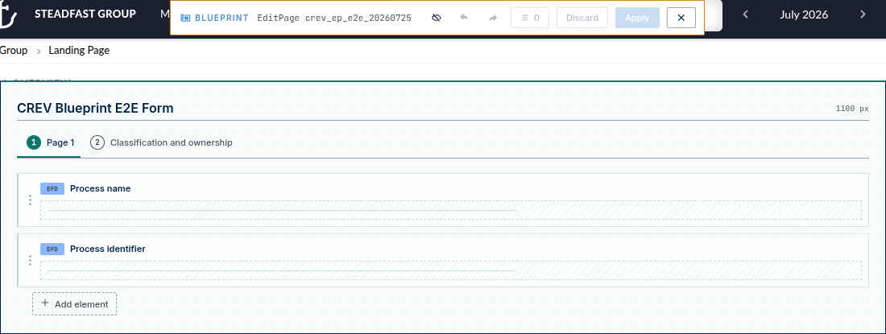

# CREV Inspector

CREV Inspector is a Chrome side-panel extension for inspecting and changing Corporater BMP without opening Configuration Studio. It labels the objects rendered on a BMP page, opens their real configuration, edits code, and stages visual layout changes.

<p align="center">
  
</p>

## Install

1. Download `crev-inspector-x.y.z.zip` from [Releases](https://github.com/HeinemannT/crev-inspector/releases/latest) and unzip it.
2. Open `chrome://extensions/` (Edge: `edge://extensions/`) and enable **Developer mode**.
3. Click **Load unpacked** and select the unzipped folder.
4. Pin CREV Inspector and open your BMP workspace.

Current Chromium browsers are supported (Chrome or Edge 114+).

## Connect to BMP

Open **Connect**, add the BMP workspace URL, then approve Chrome's site-access prompt. CREV requests access only to configured BMP origins and revokes it when you delete a profile.

Credentials are optional. With no password, CREV borrows your active browser session, including SSO, VPN, and client-certificate sessions. If you store credentials, CREV tries the browser session first and uses the stored login as a fallback.

The connection strip distinguishes these states:

- **Connected via browser session**
- **Connected via stored login**
- **Not logged in**
- **No Configuration Access**
- **Authentication failed**

## Inspect objects

Turn on **Inspect** from the header or press `Ctrl+Shift+X`. CREV outlines rendered BMP objects and adds a type-coloured ID pill.

| Gesture | Result |
|---|---|
| Click | Open the object in the side panel |
| Double-click | Open the quick inspector |
| Alt-click | Copy the RID |
| Shift-click | Copy the template business ID |
| Ctrl-click | Copy a reference such as `t.some_id` |
| Right-click an element | Use it as the current context |

The object view groups what you can do:

- **Code** lists direct and referenced code properties. Click **Edit** to open the correct editor.
- **Structure** shows parents, children, linked objects, siblings, and supported action or input flows.
- **Info** shows the type, business ID, RID, web link, access test, and favourite action.
- **instance / template** chooses where a supported property or name change is saved.

Use the pencil beside a supported object name to rename it. CREV asks for confirmation before saving.

## Edit Extended Code, HTML, and CVOs

The Extended Code editor opens from a code property or with `Ctrl+Shift+E`. It provides EC syntax highlighting, completion, hover documentation, linting, folding, runtime errors, and object-aware suggestions for `t.<id>` references and inferred variables.

<p align="center">
  
</p>

Use **Preview** (`Ctrl+Enter`) before **Run** (`Ctrl+Shift+Enter`). Run stays gated until the current code previews successfully. The lower panel shows structured output, tracked variables, run history, timings, and safe HTML or JSON views when the output supports them.

Text and CVO properties open in their dedicated studios:

- **Text/HTML** previews the stored HTML in an inert, sanitized frame.
- **CVO Studio** edits HTML and JavaScript side by side, supplies live CVO data, manages inputs and hosted resources, and runs the preview in a separate sandbox.

## Rebuild a page in Blueprint

Press `Ctrl+Shift+B` to place Blueprint over the live page. Choose **Template** or **This instance**, then work with the structure BMP actually renders.

<p align="center">
  
</p>

Blueprint supports:

- adding, moving, reordering, resizing, renaming, and removing supported tabs, containers, and widgets
- editing layout and visual properties without leaving the page
- following InputView to InputSet and CreateObjectView to EditPage
- creating and linking a missing InputSet or EditPage
- inspecting action menus and supported flow chains in place

Changes remain staged. The counter, undo, redo, and discard controls operate on the draft. **Apply** first shows the affected objects, then asks for confirmation before it writes to BMP.

### Edit pages

Edit Page Blueprint follows page navigation, page breaks, columns, field order, and the configured form width. Move fields within or between columns and pages, add supported elements, and edit field properties while seeing the rendered form structure.

<p align="center">
  
</p>

A CreateObjectView can select an existing EditPage or stage a new one. New EditPages inherit the object class needed to configure their fields immediately.

## Find references, code, and differences

- **Browse** searches cached objects by RID, business ID, or name.
- **Code Search** scans Extended Code across the workspace and opens the exact source property.
- **References** answers "Who references this?" from the current object.
- **Diff** compares RID to RID, instance to template, or two `namespace.businessId` references.

## Use the optional AI assistant

Open **Connect → AI Assistant → Set up**. Built-in presets cover Anthropic, OpenAI, DeepSeek, and Grok. The AI UI stays hidden until you configure a provider.

For another endpoint, click **Add custom provider** and edit the JSON:

```json
{
  "name": "OpenRouter",
  "vendor": "openrouter",
  "apiKey": "",
  "apiType": "openai",
  "models": [
    {
      "id": "anthropic/claude-sonnet-4",
      "name": "Claude Sonnet 4",
      "url": "https://openrouter.ai/api/v1",
      "toolCalling": true,
      "vision": true,
      "maxInputTokens": 200000,
      "maxOutputTokens": 64000,
      "maxTokensParam": "max_completion_tokens"
    }
  ]
}
```

`apiType` selects the wire format and accepts `openai` or `anthropic`. OpenAI-format models default to `max_completion_tokens`; set `maxTokensParam` to `max_tokens` for DeepSeek and older compatible APIs. At least one model must enable `toolCalling`. CREV encrypts the key and removes it from the saved JSON.

Chat uses the current object and page context. Object references render as the same hoverable, clickable chips used elsewhere in CREV. Code changes are proposals until you review and save them.

## Shortcuts

| Default | Action |
|---|---|
| `Ctrl+Shift+Y` | Toggle the side panel |
| `Ctrl+Shift+X` | Toggle Inspect |
| `Ctrl+Shift+E` | Open the Extended Code editor |
| `Ctrl+Shift+B` | Toggle Blueprint |

Rebind shortcuts at `chrome://extensions/shortcuts`.

## Data and security

- Borrowed tokens live in `chrome.storage.session` and disappear when the browser closes.
- Stored passwords and AI keys are AES-GCM encrypted in `chrome.storage.local`.
- A borrowed token is separate from the token used by the BMP tab.
- HTTP profile URLs show a warning.
- **Reset all state** clears cache, logs, context, and history while keeping profiles and favourites.

The detailed [feature walkthrough](docs/walkthrough.html) covers the remaining controls and states.

## Development

```bash
npm install
npm run typecheck
npm run lint
npm test
npm run build
```

CI runs the same four gates. A `v*.*.*` tag publishes the packaged extension after they pass.
